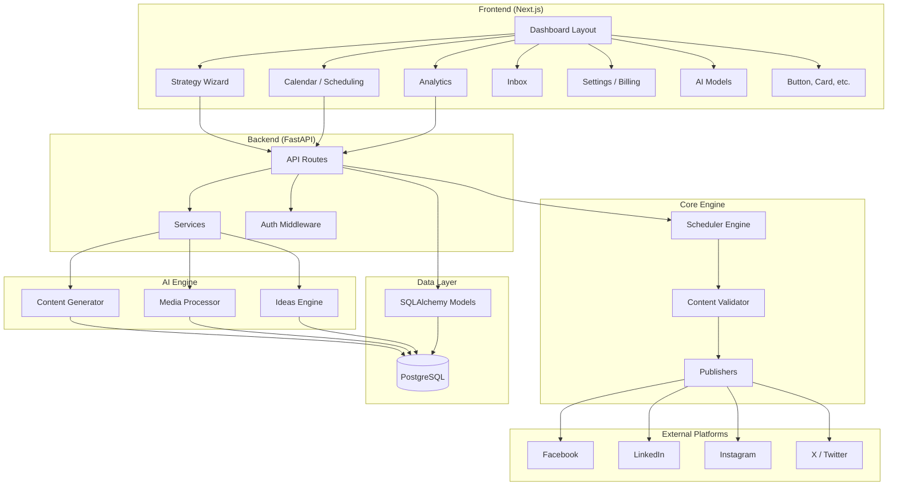

# Architecture — social-media-app

> Auto-generated from GitNexus knowledge graph (358 files, 4960 symbols, 300 processes).
> Last indexed: 2026-07-18 | Commit: `855e152`

---

## Overview

A full-stack social media management platform with:

- **Backend**: Python/FastAPI — API layer, services, scheduling engine, AI content generation, publisher integrations
- **Frontend**: Next.js/React — dashboard UI with strategy wizard, calendar, analytics, inbox, and settings
- **AI Engine**: LLM-powered content generation, media processing, and recommendations
- **Scheduler**: Cron-based bulk post scheduling with content validation and platform-specific publishing

---

## Functional Areas

| Area | Symbols | Cohesion | Purpose |
|------|---------|----------|---------|
| **Api** | 506 | 63% | FastAPI route handlers — scheduler, AI content, analytics, auth, billing |
| **Scheduler** | 209 | 98% | Post scheduling engine — bulk scheduling, queue management, retry logic |
| **Services** | 153 | 78% | Business logic — content validation, publisher adapters, analytics |
| **Ui** | 39 | 72% | React components — dashboard layout, sidebar, reusable UI primitives |
| **Models** | 30 | 100% | SQLAlchemy/Pydantic models — strategies, content slots, brand voice |
| **Publishers** | 24 | 98% | Platform adapters — Facebook, LinkedIn, Instagram, X/Twitter |
| **Ai_engine** | 23 | 90% | LLM integration — content generation, media processing, ideas |
| **Media** | 15 | 82% | Image/video handling — upload, optimization, storage |
| **Middleware** | 10 | 95% | Auth, rate limiting, request validation |
| **Calendar** | 8 | 83% | Calendar/scheduling UI views |
| **Tasks** | 7 | 81% | Background task definitions |
| **Backend** | 5 | 100% | App entrypoint, DB config, CORS, lifespan |

---

## Key Execution Flows

### 1. Bulk Post Scheduling (cross-community, 6 steps)

The primary content publishing pipeline:

```
bulk_schedule_posts (api/scheduler_api.py)
  → bulk_schedule (api/scheduler_api.py)
    → validate_post (services/content_validator.py)
      → validate_caption (services/content_validator.py)
        → get_limits (services/content_validator.py)
          → get_publisher (services/publishers/__init__.py)
            → content_limits (services/publishers/base.py)
```

**Path A** validates content against platform limits (caption length, media constraints).
**Path B** resolves the correct publisher adapter (Facebook/LinkedIn/Instagram/X) for the target platform.

### 2. Strategy Wizard (frontend, 5 steps)

Multi-step strategy creation flow:

```
StrategyWizard (app/dashboard/strategy/wizard/page.tsx)
  → DashboardLayout (components/layout/dashboard-layout.tsx)
    → Sidebar (components/layout/sidebar.tsx)
      → Button (components/ui/button.tsx)
        → cn (lib/utils.ts)
```

All dashboard pages share the same layout shell: `DashboardLayout → Sidebar → Button → cn()`.

### 3. Dashboard Page Rendering (all pages follow this pattern)

Every dashboard page routes through the shared layout:

| Page | Entry Point |
|------|-------------|
| Scheduling | `app/dashboard/calendar/page.tsx` |
| Analytics | `app/dashboard/analytics/page.tsx` |
| Listening | `app/dashboard/listening/page.tsx` |
| AI Models | `app/dashboard/ai-models/page.tsx` |
| Competitors | `app/dashboard/competitors/page.tsx` |
| Connections | `app/dashboard/connections/page.tsx` |
| Settings | `app/dashboard/settings/page.tsx` |
| Billing | `app/dashboard/billing/page.tsx` |
| Inbox | `app/dashboard/inbox/page.tsx` |
| Recommendations | `app/dashboard/recommendations/page.tsx` |

---

## Architecture Diagram



---

## Data Model (key entities)

| Entity | Purpose |
|--------|---------|
| `ContentStrategy` | Brand strategy definition — tone, goals, target audience |
| `ContentPlan` | Scheduled content plan tied to a strategy |
| `ContentSlot` | Individual post slot in a plan (time, platform, status) |
| `BrandVoice` | Brand voice guidelines for AI generation |
| `ContentValidator` | Validates posts against platform-specific limits |

---

## Tech Stack

| Layer | Technology |
|-------|-----------|
| Frontend | Next.js, React, Tailwind CSS, shadcn/ui |
| Backend | Python, FastAPI, SQLAlchemy, Alembic |
| Database | PostgreSQL |
| AI | LLM API (content generation, ideas, media) |
| Deployment | Docker Compose |
| Scheduling | APScheduler / cron-based |

---

*Generated from GitNexus knowledge graph — 4960 symbols, 37320 relationships, 300 execution flows.*
